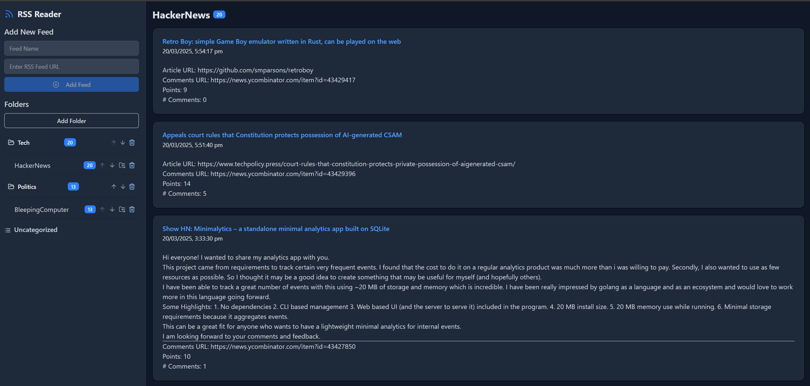

# Simple React RSS Reader

## Stack
* frontend - React, TypeScript, Vite
  * `npm run dev` to launch dev mode
* backend (tbd)

## More Information
* Why?
  * Dive into learning a little more about the MEAN/MERN stack and also docker containerization. I used to have my own custom built PHP framework a few years ago and never dove into publically available stacks. This project is to learn how to build a rather simple app and make it easy to launch via docker containers

## LICENSE
Copyright (C) 2025 Eric Turner

    This program is free software: you can redistribute it and/or modify
    it under the terms of the GNU General Public License as published by
    the Free Software Foundation, either version 3 of the License, or
    (at your option) any later version.

    This program is distributed in the hope that it will be useful,
    but WITHOUT ANY WARRANTY; without even the implied warranty of
    MERCHANTABILITY or FITNESS FOR A PARTICULAR PURPOSE.  
See [LICENSE](./LICENSE) for more details.